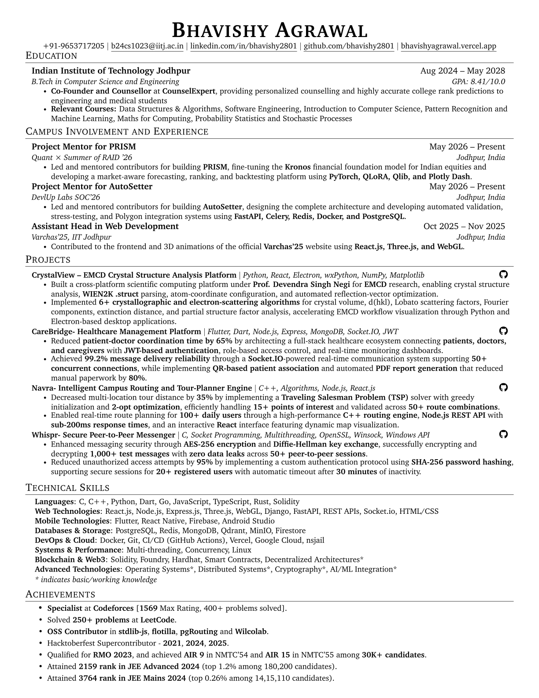

## GitHub Activity Graph:

  

  <a href="https://github.com/bhavishy2801">
    
  <a href="https://github.com/bhavishy2801">
    

  <a href="https://github.com/bhavishy2801">
    
  <a href="https://github.com/bhavishy2801">
    

 <a href="https://github.com/bhavishy2801">
    

  
   
  </a>
  
  </a>
  
  
   
  
 

